<div align="center">

# PA4 Submission: TaskFlow Pipeline


</div>

<div style="background:#f5f3ff;color:#111827;border-left:6px solid #6330bc;padding:14px 18px;border-radius:10px;margin:18px 0;">
This file contains the complete PA4 evidence and write-up for the TaskFlow Azure multi-service cloud pipeline. All screenshots are stored in the <code style="color:#111827;background:#ddd6fe;padding:2px 4px;border-radius:4px;">docs/</code> folder and embedded using relative paths so the grader does not need any file outside this repository.
</div>

## Student Information

| Field | Value |
|---|---|
| Name | Kashif Zafar |
| Roll Number | 27100431 |
| GitHub Repository URL | https://github.com/KashifZafar27100431/CS487-PA4 |
| Resource Group | `rg-sp26-27100431` |
| Assigned Region | `ukwest` |

## Project Overview

TaskFlow is an Azure multi-service cloud pipeline. A user submits an order through a web dashboard hosted on Azure App Service. The web app calls a containerized Azure Durable Function, which starts an orchestration, validates the order through a validator API on AKS, and then creates a one-shot report-generation container through Azure Container Instances. The generated PDF report is written to the `reports` container in Azure Blob Storage, while Azure Container Registry stores the container images used by the Function App, validator, and report job.

## Evidence Rules Followed

- All screenshots are embedded with relative paths from the `docs/` folder.
- Each screenshot has a short description explaining what it proves.
- Azure Portal screenshots show the resource name and page context where available.
- CLI screenshots show both the command and output.
- Secrets such as function keys, ACR passwords, and storage credentials are not shown directly.

---

# Task 1: App Service Web App (15 points)

## Evidence 1.1: Forked Repository

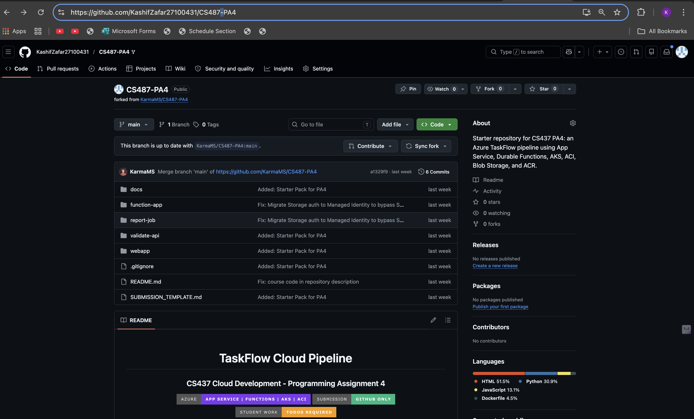

Description: This screenshot shows my forked GitHub repository `KashifZafar27100431/CS487-PA4`. It proves that I am working from my own fork of the PA4 starter repository and that the project contains the required starter folders such as `webapp`, `function-app`, `validate-api`, and `report-job`.

## Evidence 1.2: App Service Overview

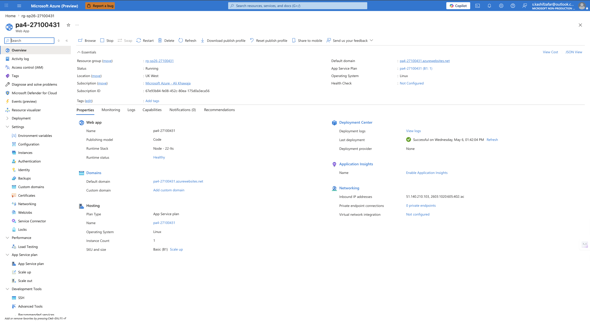

Description: This screenshot shows the Azure Web App `pa4-27100431` running inside the resource group `rg-sp26-27100431`. It proves that the App Service was created successfully in UK West, is running on Linux, and is hosted using the `pa4-27100431` App Service Plan.

## Evidence 1.3: Deployment Center / GitHub Actions

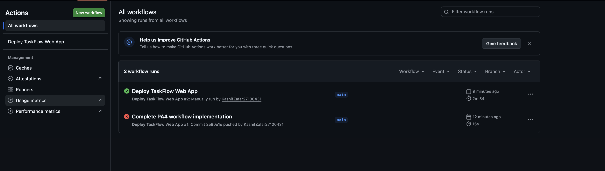

Description: This screenshot shows the GitHub Actions workflow for deploying the TaskFlow web app. The successful run proves that the GitHub-based deployment pipeline was configured correctly and that the web app can be deployed from the repository.

## Evidence 1.4: Live Web UI

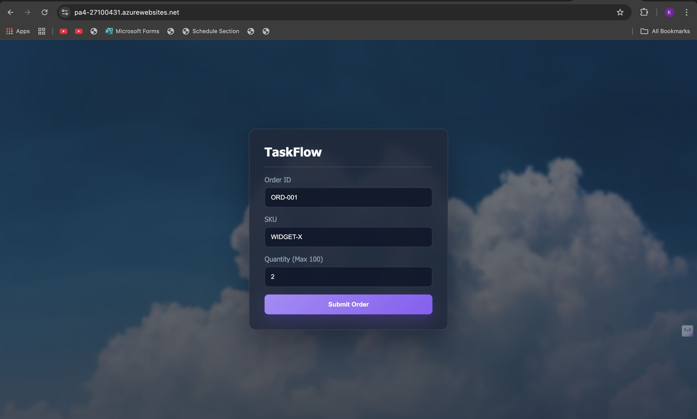

Description: This screenshot shows the TaskFlow dashboard loaded in the browser at the Azure App Service URL. It proves that the frontend is being served successfully over HTTPS and that the user can access the order submission form.

## Evidence 1.5: Web App Application Settings

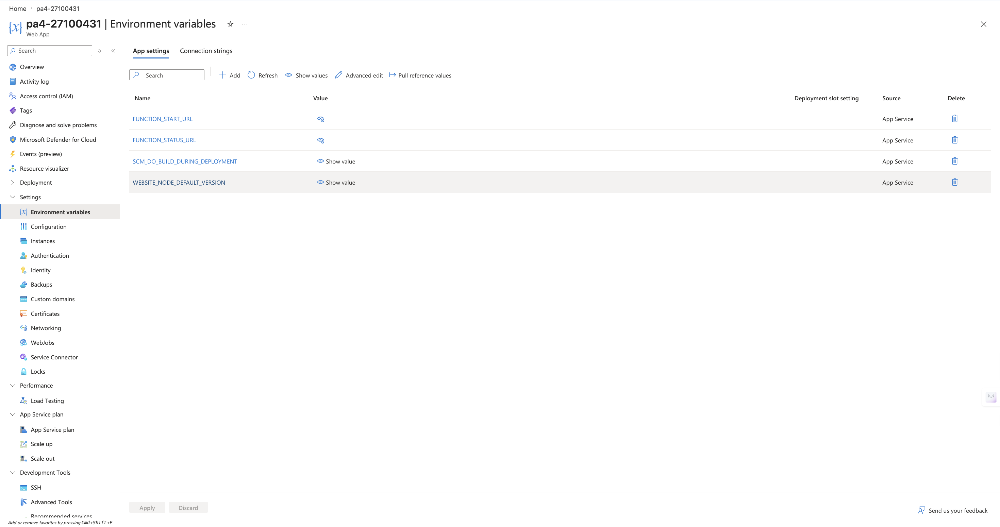

Description: This screenshot shows the web app environment variables, including `FUNCTION_START_URL` and `FUNCTION_STATUS_URL`. These settings are needed so the frontend can start the Durable Function orchestration and poll the orchestration status after backend wiring is completed.

---

# Task 2: Azure Container Registry (15 points)

## Evidence 2.1: ACR Overview

.png)

Description: This screenshot shows the Azure Container Registry `pa427100431` in the `rg-sp26-27100431` resource group. It proves that the registry was created successfully in UK West using the Basic SKU and is ready to store container images.

## Evidence 2.2: Docker Builds

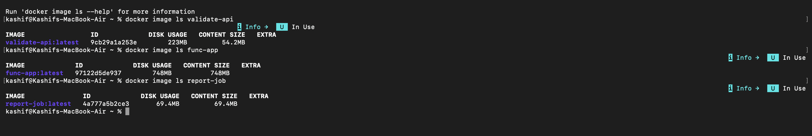

Description: This screenshot shows the local Docker images for `validate-api`, `func-app`, and `report-job`. It proves that all three required images were built locally before being tagged and pushed to Azure Container Registry.

## Evidence 2.3: Local Validator Test

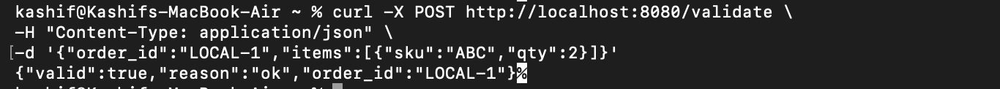

Description: This screenshot shows a local `curl` request to the validator API running on `localhost:8080`. The JSON response proves that the validator container works locally before being deployed to AKS.

## Evidence 2.4: Successful Pushes to ACR

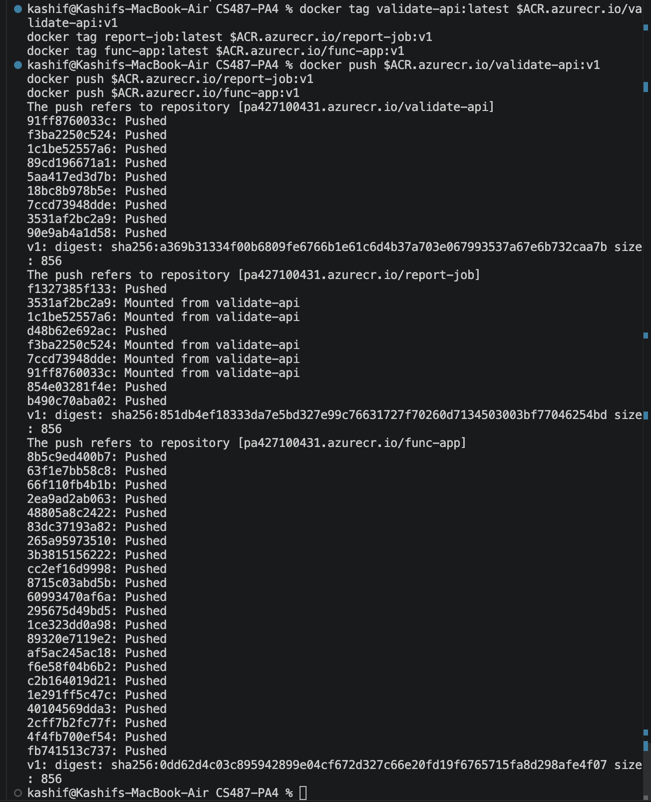

Description: This screenshot shows the Docker push output for the images pushed to `pa427100431.azurecr.io`. It proves that the container images were successfully uploaded to Azure Container Registry with the `v1` tag.

## Evidence 2.5: ACR Repositories

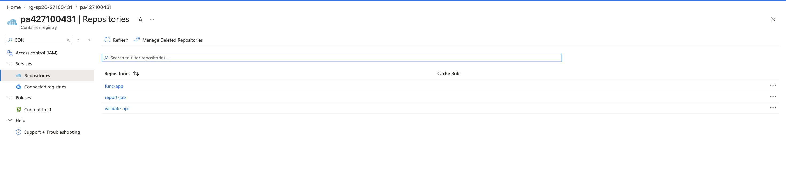

Description: This screenshot shows the repositories inside Azure Container Registry: `func-app`, `report-job`, and `validate-api`. It proves that all required images are available in ACR for the Function App, ACI report job, and AKS validator deployment.

---

# Task 3: Durable Function Implementation (12 points)

## Evidence 3.1: Completed Function Code

[Completed Durable Function code](function-app/function_app.py)

Description: The completed `function_app.py` contains the HTTP starter, orchestrator, validation activity, and report activity. The orchestrator receives the order payload, calls `validate_activity`, stops with a rejected result if validation fails, and calls `report_activity` when the order is valid.

## Evidence 3.2: Local Function Handler Listing

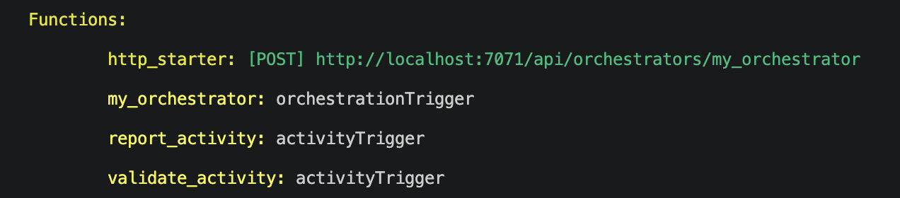

Description: This screenshot shows the local Azure Functions runtime listing `http_starter`, `my_orchestrator`, `report_activity`, and `validate_activity`. It proves that the Durable Functions runtime discovered all required handlers successfully.

---

# Task 4: Function App Container Deployment (8 points)

## Evidence 4.1: Function App Container Configuration

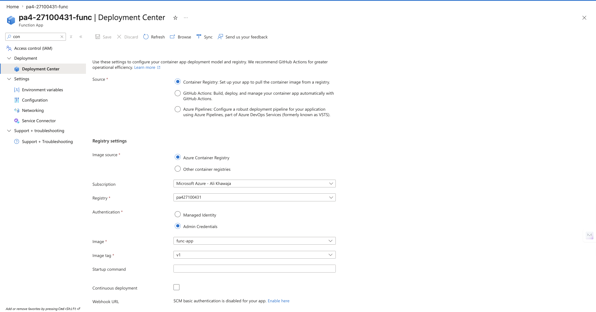

Description: This screenshot shows the Function App configured to pull the `func-app:v1` image from Azure Container Registry `pa427100431`. It proves that the Durable Function was deployed as a containerized Function App rather than only running locally.

## Evidence 4.2: Function List in Azure Portal

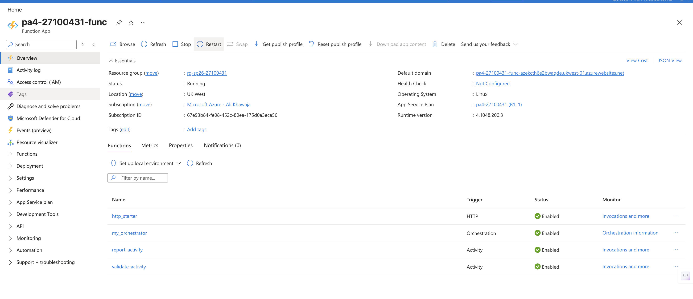

Description: This screenshot shows the deployed Function App with all required functions enabled: `http_starter`, `my_orchestrator`, `report_activity`, and `validate_activity`. It proves that the containerized Function App started successfully and loaded the Durable Function handlers.

## Evidence 4.3: Orchestration Smoke Test

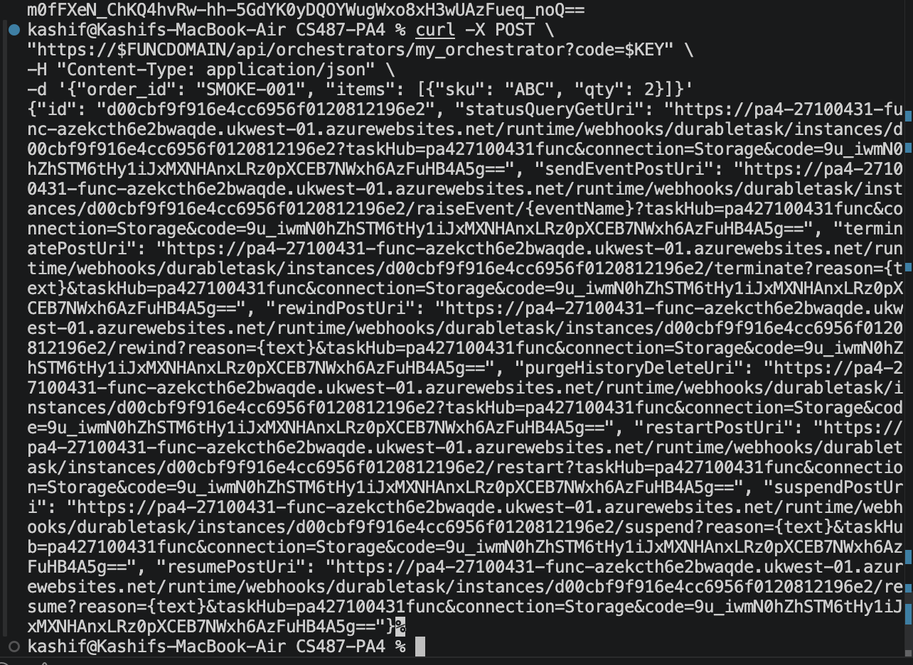

Description: This screenshot shows a `curl` request to the deployed HTTP starter endpoint. The response includes an orchestration `id` and `statusQueryGetUri`, proving that the deployed Function App can start a Durable Function orchestration.

## Evidence 4.4: Expected Failed Status Before Downstream Wiring

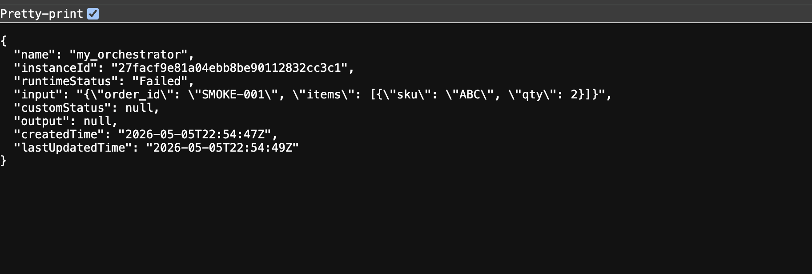

Description: This screenshot shows the orchestration status query returning `Failed` at this stage. This failure was expected because the downstream validator URL was not fully wired yet, but the result still proves that the orchestration started and the Durable Functions status endpoint was working.

---

# Task 5: AKS Validator (15 points)

## Evidence 5.1: Kubernetes Nodes

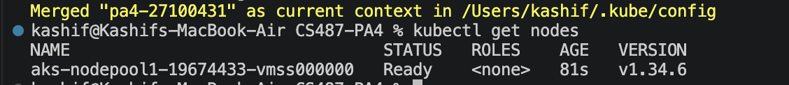

Description: This screenshot shows `kubectl get nodes` returning a ready AKS node. It proves that the AKS cluster was created successfully and that my local `kubectl` context was connected to the cluster.

## Evidence 5.2: Kubernetes Pods

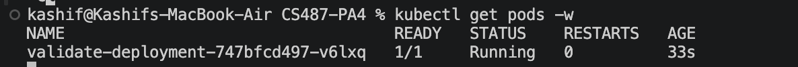

Description: This screenshot shows `kubectl get pods -w` with the `validate-deployment` pod in `Running` status and `1/1` ready. It proves that the validator API container was deployed successfully inside AKS.

## Evidence 5.3: Kubernetes Service

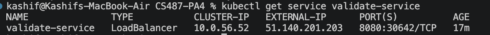

Description: This screenshot shows the `validate-service` Kubernetes service of type `LoadBalancer`. It proves that the validator API was exposed using the external IP `51.140.201.203` on port `8080`.

## Evidence 5.4: Health Check

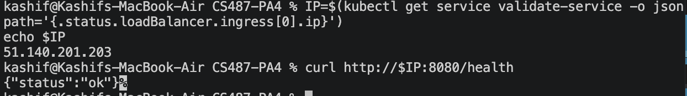

Description: This screenshot shows a `curl` request to `http://51.140.201.203:8080/health` returning `{"status":"ok"}`. It proves that the AKS validator service was reachable from outside the cluster and responding correctly.

## Evidence 5.5: Validator API Tests

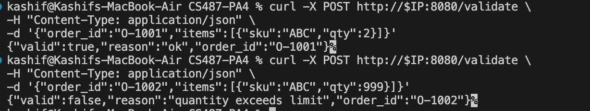

Description: This screenshot shows two validator API tests. The order with quantity `2` returned `valid: true`, while the order with quantity `999` returned `valid: false` with the reason `quantity exceeds limit`, proving that the validator accepts valid orders and rejects invalid orders above the quantity limit.

## Evidence 5.6: Function App `VALIDATE_URL`

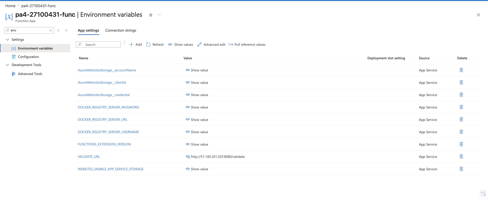

Description: This screenshot shows the Function App application setting `VALIDATE_URL` set to `http://51.140.201.203:8080/validate`. It proves that the Durable Function was configured to call the AKS validator during the orchestration.

## Evidence 5.7: AKS Idle Behavior

Description: When the AKS validator is idle, the node and pod remain running. In this project, “idle” means there are no current order validation requests hitting the validator API, but the Kubernetes node is still allocated and the validator pod remains ready. This is different from ACI because AKS still has a running node even when there is no user traffic.

---

# Task 6: ACI Report Job (15 points)

## Evidence 6.1: Blob Container

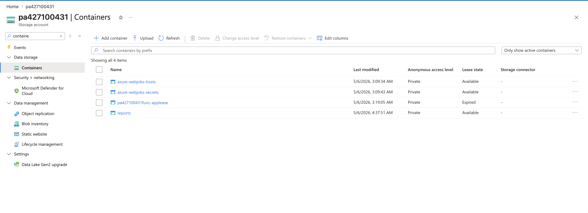

Description: This screenshot shows the `reports` container inside the storage account `pa427100431`. It proves that the Blob Storage location for generated PDF reports was created successfully.

## Evidence 6.2: Manual ACI Run

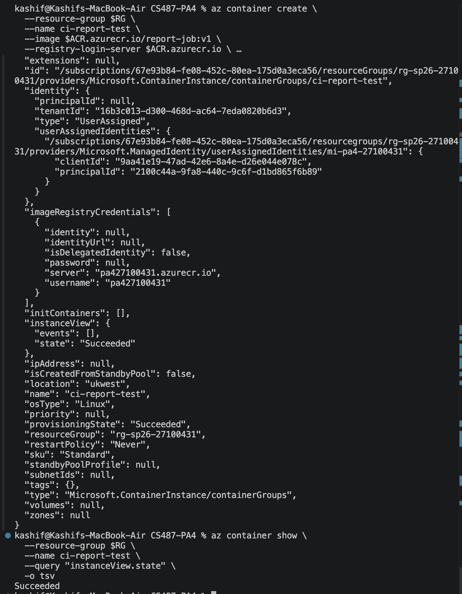

Description: This screenshot shows the manual ACI test container `ci-report-test` with `instanceView.state` equal to `Succeeded`. It proves that the report job container started, completed its work, and exited as a one-shot job.

## Evidence 6.3: ACI Logs

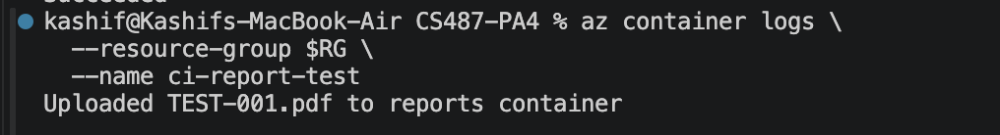

Description: This screenshot shows the ACI logs printing `Uploaded TEST-001.pdf to reports container`. It proves that the report job successfully generated the PDF and uploaded it to the Blob Storage `reports` container.

## Evidence 6.4: Generated PDF

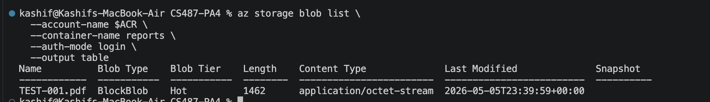

Description: This screenshot shows `TEST-001.pdf` listed in the reports container output. It proves that the report job wrote the expected PDF file to Blob Storage.

## Evidence 6.5: Function App Managed Identity

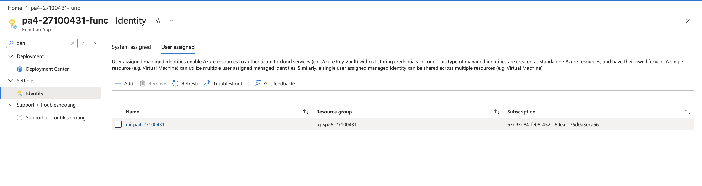

Description: This screenshot shows the user-assigned managed identity `mi-pa4-27100431` attached to the Function App. This identity is required so the Function App can authenticate to Azure and create ACI container groups programmatically without storing Azure credentials in code.

## Evidence 6.6: Report App Settings

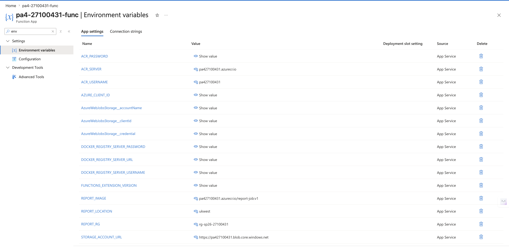

Description: This screenshot shows the Function App settings used by `report_activity`, including `ACR_SERVER`, `ACR_USERNAME`, `REPORT_IMAGE`, `REPORT_LOCATION`, `REPORT_RG`, and `STORAGE_ACCOUNT_URL`. These settings allow the Durable Function to know which image to run, where to create the ACI, and where the report output should be stored.

---

## Task 7: End-to-End Pipeline (15 points)

### Evidence 7.1: Web App Wiring

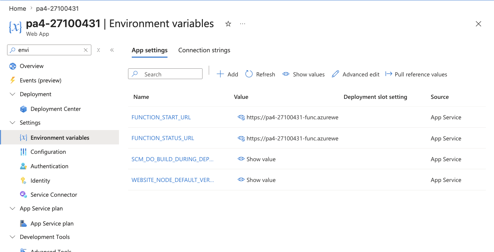

Description: This screenshot shows the Web App environment variables `FUNCTION_START_URL` and `FUNCTION_STATUS_URL` configured. These settings allow the frontend App Service to start the Durable Function orchestration and then poll the orchestration status until the workflow completes.

---

### Evidence 7.2: Happy Path UI — Form Before Submit

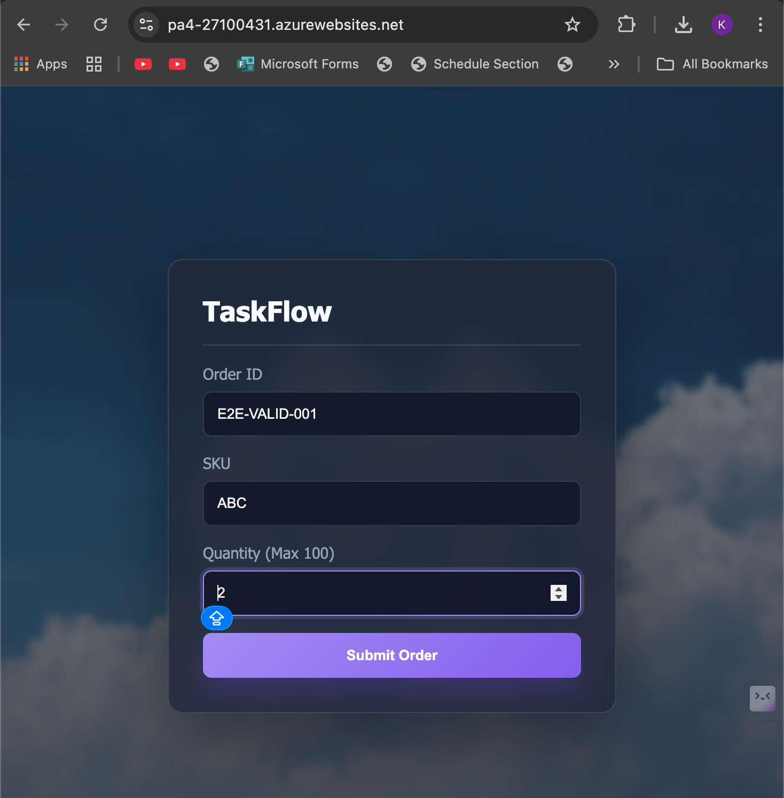

Description: This screenshot shows the live TaskFlow web app loaded from the Azure App Service URL. The form is filled with a valid order payload: order ID `E2E-VALID-001`, SKU `ABC`, and quantity `2`, which is within the allowed maximum quantity.

---

### Evidence 7.3: Happy Path UI — Running Status

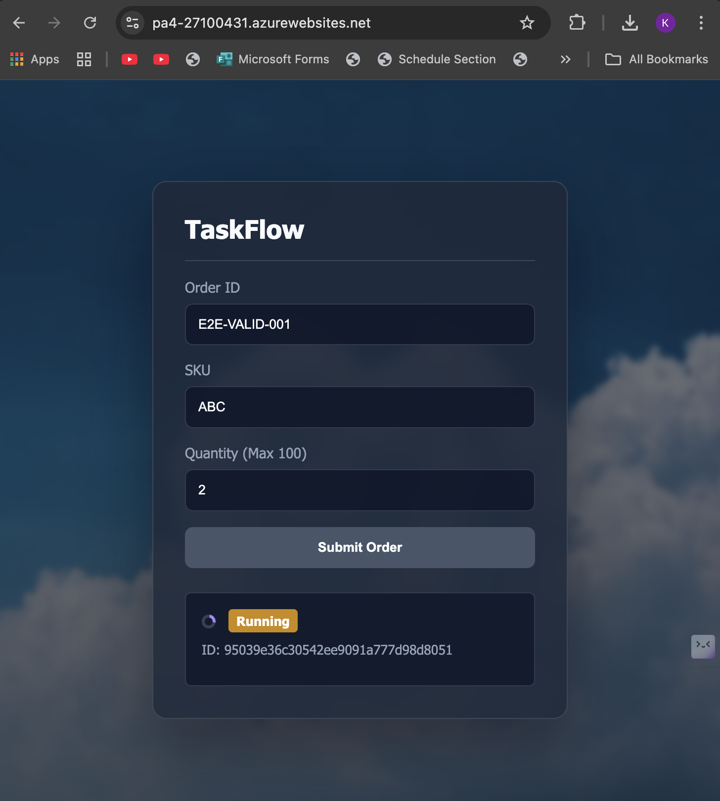

Description: This screenshot shows the TaskFlow UI after submitting the valid order. The status panel displays `Running` with an orchestration instance ID, proving that the frontend successfully called the Durable Function starter endpoint and the workflow started.

---

### Evidence 7.4: Happy Path UI — Completed Status

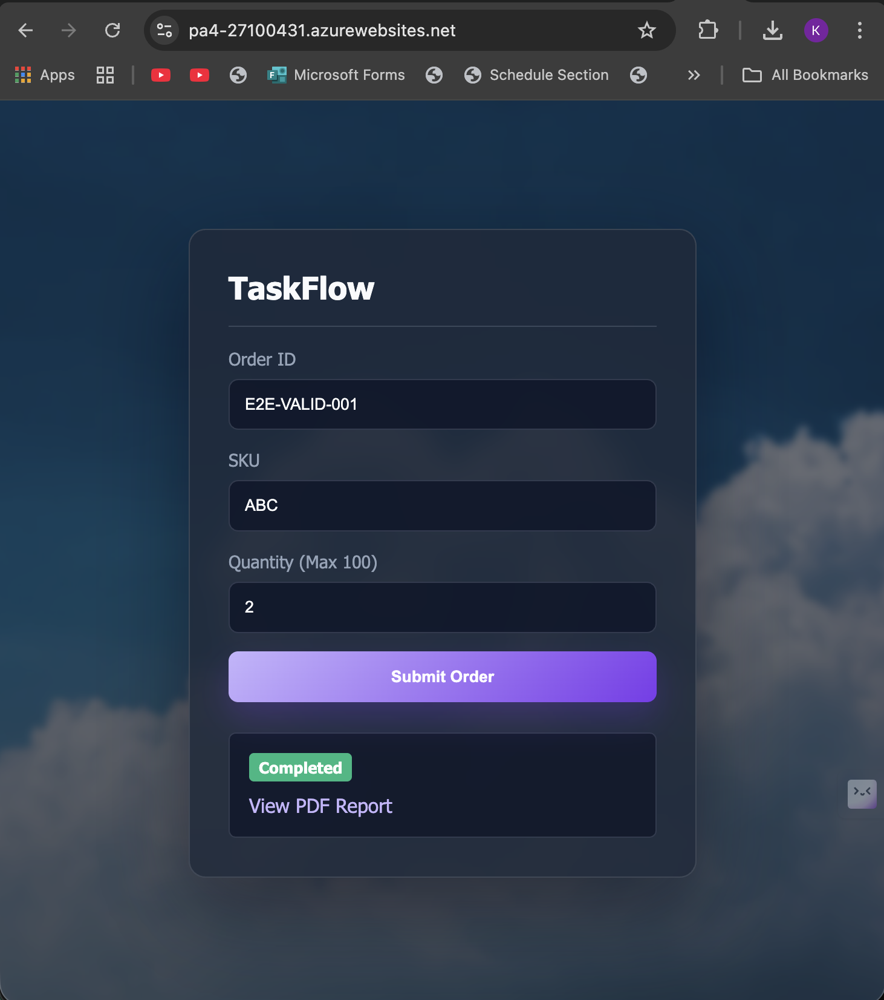

Description: This screenshot shows the valid order completing successfully. The UI displays `Completed` and provides a `View PDF Report` link, proving that the Durable Function completed the validation and report-generation workflow.

---

### Evidence 7.5: Durable Function Status Query

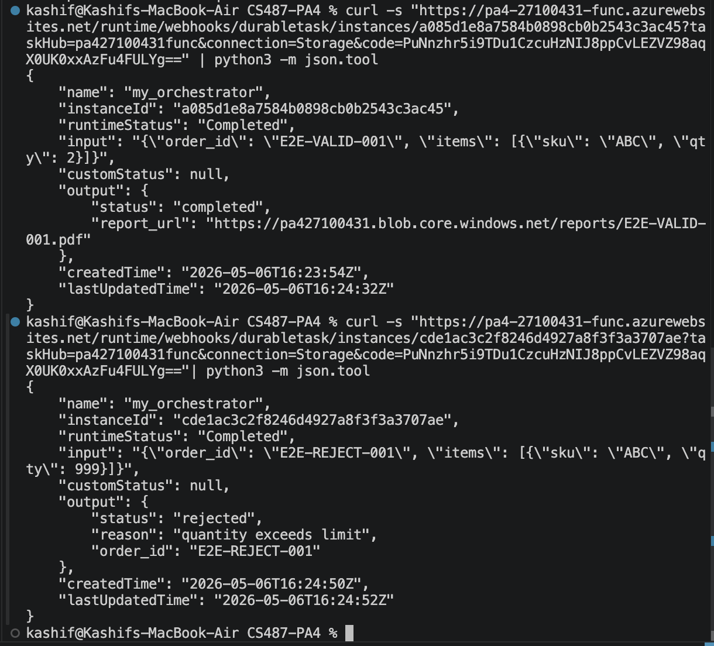

Description: This screenshot shows the Durable Function status query output for both the valid and rejected end-to-end test cases. The valid order `E2E-VALID-001` completed successfully and returned a `report_url`, while the rejected order `E2E-REJECT-001` completed with status `rejected` and reason `quantity exceeds limit`.

---

### Evidence 7.6: Blob Storage PDF Output

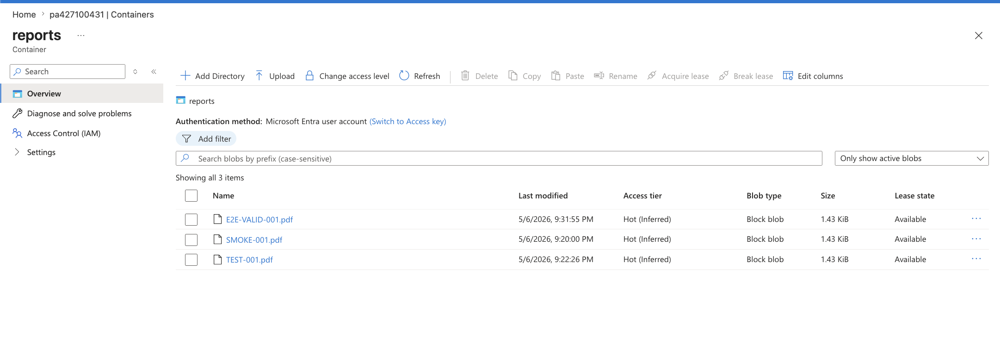

Description: This screenshot shows the `reports` blob container containing generated PDF files. The file `E2E-VALID-001.pdf` proves that the end-to-end valid order caused the report job to generate and upload a PDF to Azure Blob Storage.

---

### Evidence 7.7: ACI Participation

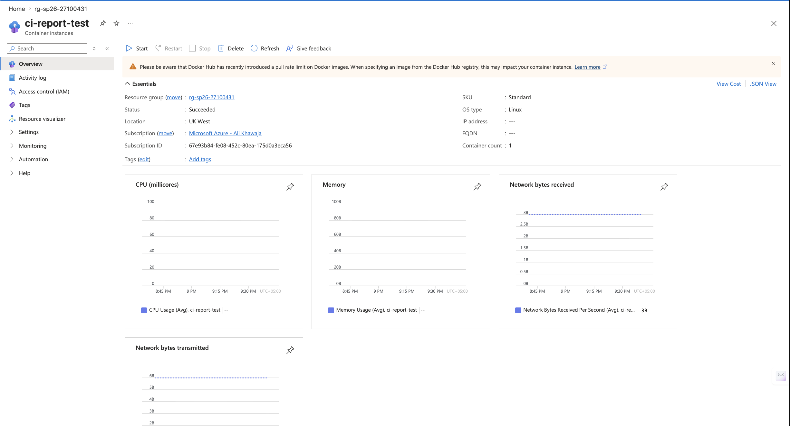

Description: This screenshot shows the Azure Container Instance `ci-report-test` with status `Succeeded`. It proves that the report-generation workload runs as a container job and exits after completing its work, which matches the intended one-shot ACI behavior.

---

### Evidence 7.8: Reject Path UI

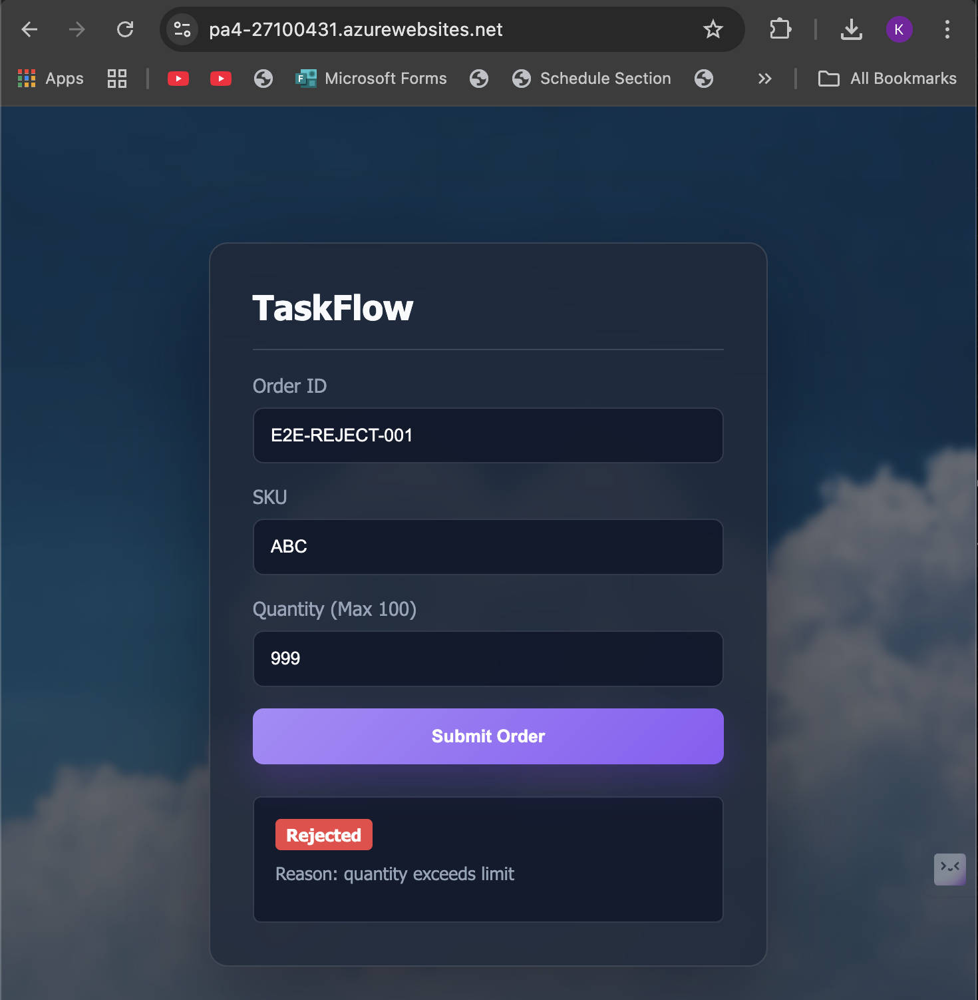

Description: This screenshot shows the invalid order path using order ID `E2E-REJECT-001` with quantity `999`. Since the validator rejects quantities greater than `100`, the UI correctly displays `Rejected` with the reason `quantity exceeds limit`.

---

### Evidence 7.9: Resource Group Overview

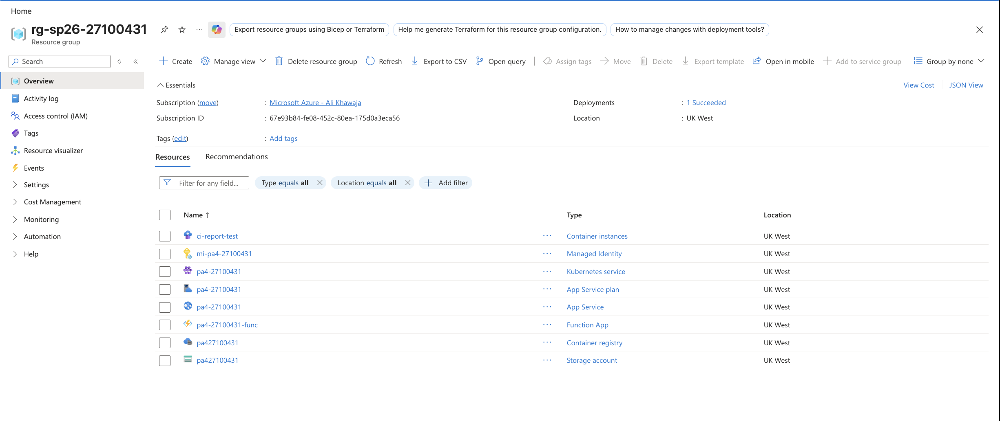

Description: This screenshot shows the deployed Azure resources in resource group `rg-sp26-27100431`. It includes the App Service, App Service Plan, Function App, Container Registry, Storage Account, AKS cluster, Managed Identity, and Container Instance, proving that the full TaskFlow architecture was deployed inside the assigned resource group.

---

### Task 7 Summary

Task 7 confirms that the full TaskFlow pipeline works end to end. The Web App submits an order to the Durable Function, the Durable Function starts an orchestration, the validator accepts or rejects the order, and the valid path produces a PDF report in Blob Storage. The rejected path also works correctly because an invalid quantity returns a rejection message instead of generating a report.

---

# Task 8: Write-up and Architecture Diagram (5 points)

## Evidence 8.1: Architecture Diagram

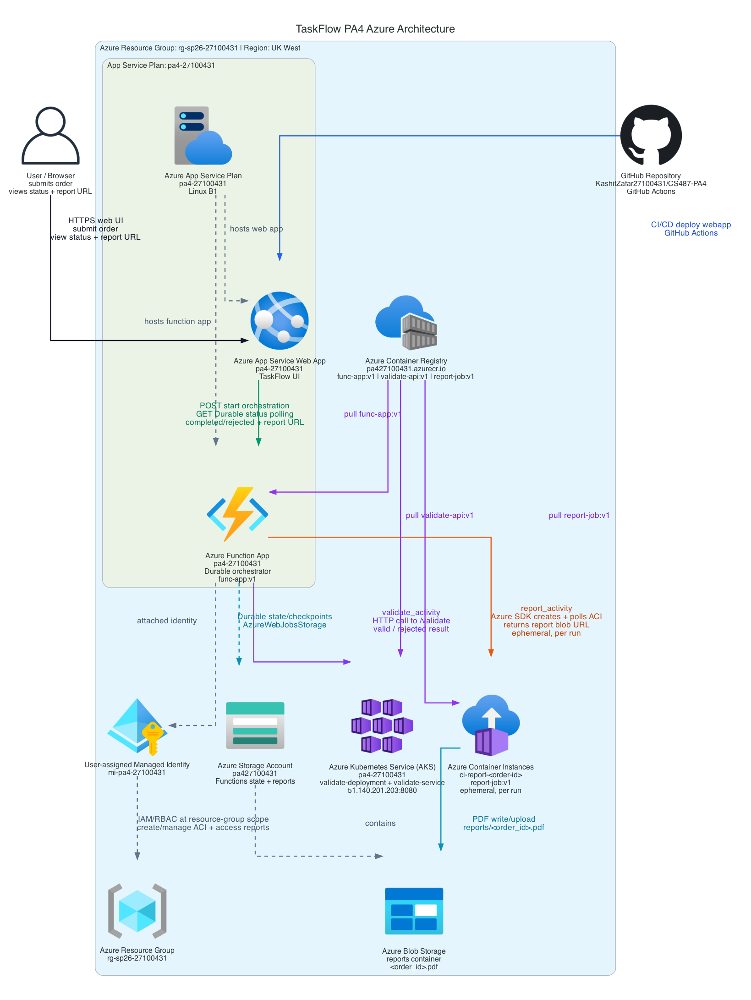

Description: The architecture diagram should show GitHub, App Service, Durable Function App, AKS validator, ACI report job, Blob Storage, Azure Container Registry, and the managed identity/IAM relationship used by the Function App.

## Question 8.2: Service Selection

### App Service

Azure App Service is the right choice for the TaskFlow frontend because it provides managed web hosting without needing to manage a virtual machine. It supports GitHub-based deployment, which made it easy to connect the repository and deploy the Node.js/Express dashboard using GitHub Actions. From a cost perspective, the Basic B1 App Service Plan is suitable for this assignment because the web dashboard is lightweight and does not need a large amount of compute. Operationally, App Service keeps the frontend simple because Azure manages the web hosting platform, runtime environment, HTTPS endpoint, and deployment integration.

### Durable Functions

Durable Functions are the correct choice for the TaskFlow orchestration layer because the workflow has multiple steps and needs state tracking. The orchestrator receives the order, calls the validator, branches based on the validation result, and then starts the report-generation activity only when needed. This is better than a single HTTP request because the report step can take time and the workflow needs a reliable status URL for polling. Durable Functions also reduce operational complexity because they automatically persist orchestration state and make long-running workflows easier to monitor.

### Azure Kubernetes Service (AKS)

AKS is the right tool for the validator because the validator is a long-running HTTP microservice that must remain available for order validation requests. Kubernetes provides a declarative operational model through deployments and services, allowing the validator pod and LoadBalancer service to be managed cleanly. The tradeoff is cost: even when there are no orders, the AKS node can remain allocated, which means AKS is not as cost-efficient for idle workloads as ACI. However, AKS is appropriate here because it demonstrates enterprise-style microservice hosting with control over pods, services, and cluster behavior.

### Azure Container Instances (ACI)

ACI is the right tool for the report job because report generation is a short-lived batch task rather than a permanent service. The container only needs to start, generate a PDF, upload it to Blob Storage, and exit. This makes ACI cost-effective because it avoids keeping another always-running Kubernetes workload alive just for occasional reports. Operationally, ACI is simpler for one-shot jobs because the Durable Function can create the container group through the Azure SDK and let it stop after completion.

## Question 8.3: ACI vs AKS

When AKS is idle for 10 minutes, the validator pod and AKS node still remain running unless the cluster or deployment is manually scaled down. In this project, idle AKS means there are no incoming order validation requests, but the cluster resources are still allocated and ready to serve traffic. This is why AKS can continue to incur cost even when there is no active user traffic.

For ACI, “idle” has a different meaning in this pipeline. The report job is not supposed to sit idle waiting for requests; it is created only when a valid order needs a report, runs once, uploads the PDF, and exits. After it reaches `Succeeded`, it is no longer performing work and should be deleted or left stopped only briefly for evidence.

If a malicious user spammed the Submit button 1000 times in one minute, ACI would likely create the largest additional cost because every valid request could trigger a new report-generation container. AKS already has a running node, so spam traffic would increase load on the validator, but the biggest variable cost would come from repeatedly creating many ACI report jobs. Durable Functions and App Service would also receive traffic, but the per-run container creation for report generation is the most direct cost multiplier.

## Question 8.4: Durable Functions vs Plain HTTP

Using two plain HTTP-triggered functions would make this workflow harder because the report generation step can take up to a minute and may exceed normal expectations for a simple request-response chain. A plain HTTP setup would also need custom state storage to remember whether validation succeeded before starting the report step. Durable Functions solve this by checkpointing orchestration state and giving the frontend a `statusQueryGetUri` to poll.

Another problem with plain HTTP functions is retry and failure handling. If validation succeeds but report generation fails, a normal HTTP chain would require manual logic to decide whether to retry the report step or restart the whole process. Durable Functions provide a cleaner pattern because the orchestrator can persist progress between activities and make the workflow easier to monitor, retry, and debug.

## Question 8.5: Cost Review

TODO: Add the Cost Management screenshot scoped to `rg-sp26-27100431`.

```markdown
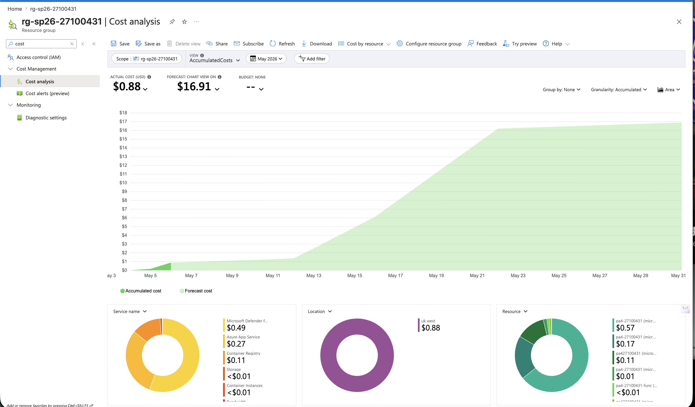
```

Description: The Cost Management screenshot should show the estimated cost consumed by this PA inside the instructor subscription. Based on the services used, the most expensive resource is likely the AKS cluster because its node can continue running even when the validator is idle. ACI is cheaper for short report jobs because it only runs during report generation, while App Service and the Function App share the Basic B1 App Service Plan.

## Question 8.6: Challenges Faced

### Challenge 1: Docker Image Architecture Issue

One major issue I faced was that Docker built images for ARM architecture by default because I was using a Mac environment. When I deployed the image to Azure, the web app/function container did not run correctly because Azure expected a `linux/amd64` image. I debugged this by rebuilding the Docker images using the `--platform linux/amd64` flag, then retagging and pushing the corrected images to Azure Container Registry. After that, the Azure services were able to pull and run the images properly.

### Challenge 2: Managed Identity Issue

Another issue I faced was accidentally deleting the managed identity required by the Function App. This broke part of the workflow because the Function App needed that identity to create ACI containers and access Azure resources without storing credentials in code. I had to wait until the TA restored or reassigned the required roles. After the managed identity and permissions were fixed, I attached `mi-pa4-27100431` to the Function App and continued the report-job configuration.

### Challenge 3: Expected Durable Function Failure During Partial Wiring

During Task 4, the Durable Function orchestration returned a `Failed` status after the smoke test. This was expected at that point because the validator service and `VALIDATE_URL` were not fully configured yet. I confirmed that the important part was working because the HTTP starter returned an instance ID and status query URL, which proved the containerized Function App was deployed and able to start the orchestration.

---

# Final Notes

This submission shows the core TaskFlow resources and evidence through App Service, Azure Container Registry, Durable Functions, AKS, and ACI. The screenshots in `docs/` prove that the web app deployed, images were pushed, the Function App started, the AKS validator worked, and the ACI report job generated and uploaded a PDF report.
